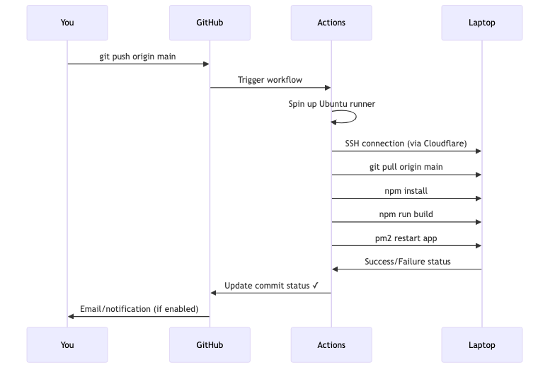

# lecrev - Self-hosting as Self-service

[](https://opensource.org/licenses/MIT)
[](https://nodejs.org/)
[](https://kit.svelte.dev/)
[](https://www.docker.com/)
[](https://ubuntu.com/)

> **"La nube ha resultado contraproducente"**
> Recuperemos el internet y dignifiquemos el open source en Hispanoamerica.

## Descripcion

**lecrev** es una metodologia practica de self-hosting que demuestra como crear infraestructura de produccion robusta usando una laptop gamer con WSL2. Este proyecto desafia la narrativa de que necesitas servicios cloud costosos para desplegar aplicaciones modernas.

Nuestro objetivo: **Dignificar el open source en Hispanoamerica** a traves de infraestructura accesible, privada y bajo tu control.

### Por que existe este proyecto?

La nube prometio simplicidad pero entrego dependencia. Este proyecto propone una alternativa:
- Privacidad por diseno (sin telemetria invasiva)
- Costos predecibles (tu hardware, tu control)
- Independencia tecnologica (sin vendor lock-in)
- Aprendizaje profundo (entiendes cada capa del stack)

## Caracteristicas

- **Infraestructura completa en WSL2**: Ubuntu corriendo en Windows, sin dual-boot
- **Reverse proxy automatico**: Caddy con HTTPS automatico via Cloudflare Tunnel
- **CI/CD sin servicios cloud**: GitHub Actions desplegando via SSH sobre tunnel seguro
- **Analytics que respetan privacidad**: Umami/Plausible en lugar de Google Analytics
- **Gestion de procesos con PM2**: Aplicaciones Node.js corriendo como servicios
- **Contenedores Docker**: PostgreSQL y analytics en contenedores aislados
- **Arquitectura multi-aplicacion**: Bot de Discord + multiples sitios SvelteKit
- **Documentacion en espanol**: Pensada para la comunidad hispanohablante

## Stack Tecnologico

### Sistema Operativo
- **Ubuntu 22.04 LTS** en WSL2 (Windows Subsystem for Linux)

### Runtime y Lenguajes
- **Node.js 18+** (JavaScript puro, sin TypeScript)
- **SvelteKit** para aplicaciones web
- **Python** (opcional, para bots de Discord)

### Infraestructura
- **Caddy** / Nginx como reverse proxy (puertos 80/443)
- **Cloudflare Tunnel** para acceso seguro desde internet
- **PM2** para gestion de procesos Node.js
- **Docker + Docker Compose** para servicios containerizados

### Servicios
- **PostgreSQL** (puerto 5432) - Base de datos
- **Umami** o **Plausible** (puerto 3004) - Analytics privadas
- **Discord Bot** (puerto 3001) - Bot personalizado
- **SvelteKit Apps** (puertos 3002-3003) - Aplicaciones web

## Arquitectura del Sistema

```
Internet → Cloudflare DNS → Cloudflare Tunnel → Caddy → Aplicaciones
```

El flujo completo se visualiza en el diagrama de arquitectura:



**Diagrama detallado**: [system-architecture.mmd](./docs/system-architecture.mmd)

### Componentes Clave

1. **Capa de Internet**: Usuarios y APIs externas (Discord)
2. **Capa Cloudflare**: DNS + Tunnel cifrado (sin abrir puertos en router)
3. **Capa de Proxy**: Caddy enrutando trafico HTTPS a aplicaciones
4. **Capa de Aplicaciones**: Bots y sitios web gestionados por PM2
5. **Capa de Datos**: PostgreSQL + Analytics en Docker

Para mas detalles, consulta:
- [Diagrama de interfaces principales](./docs/main-interfaces.mmd)
- [Flujo de despliegue](./docs/deployment-flow.mmd)

## Instalacion

### Prerequisitos

1. **Windows 10/11** con WSL2 habilitado
2. **Ubuntu 22.04** instalado en WSL2
3. **Cuenta de Cloudflare** (plan gratuito suficiente)
4. **Dominio propio** (puede ser gratis de Freenom o similar)

### Paso 1: Preparar el entorno WSL2

```bash
# Actualizar sistema
sudo apt update && sudo apt upgrade -y

# Instalar Node.js (via nvm recomendado)
curl -o- https://raw.githubusercontent.com/nvm-sh/nvm/v0.39.0/install.sh | bash
nvm install 18
nvm use 18

# Instalar Docker
curl -fsSL https://get.docker.com -o get-docker.sh
sudo sh get-docker.sh
sudo usermod -aG docker $USER

# Instalar PM2 globalmente
npm install -g pm2

# Instalar Caddy
sudo apt install -y debian-keyring debian-archive-keyring apt-transport-https
curl -1sLf 'https://dl.cloudsmith.io/public/caddy/stable/gpg.key' | sudo gpg --dearmor -o /usr/share/keyrings/caddy-stable-archive-keyring.gpg
curl -1sLf 'https://dl.cloudsmith.io/public/caddy/stable/debian.deb.txt' | sudo tee /etc/apt/sources.list.d/caddy-stable.list
sudo apt update
sudo apt install caddy
```

### Paso 2: Configurar Cloudflare Tunnel

```bash
# Descargar cloudflared
wget https://github.com/cloudflare/cloudflared/releases/latest/download/cloudflared-linux-amd64.deb
sudo dpkg -i cloudflared-linux-amd64.deb

# Autenticar con Cloudflare
cloudflared tunnel login

# Crear tunnel
cloudflared tunnel create lecrev

# Configurar DNS (reemplaza con tu dominio)
cloudflared tunnel route dns lecrev tudominio.com
cloudflared tunnel route dns lecrev "*.tudominio.com"
```

### Paso 3: Clonar y configurar el proyecto

```bash
# Clonar repositorio
git clone https://github.com/grzlz/lecrev.git
cd lecrev

# Instalar dependencias de la webapp
cd app
npm install

# Copiar plantilla de variables de entorno
cp .env.example .env
# Editar .env con tus credenciales

# Construir aplicacion
npm run build
```

### Paso 4: Configurar servicios

```bash
# Iniciar PostgreSQL y Umami con Docker
docker-compose up -d

# Verificar servicios
docker ps

# Configurar PM2 para aplicaciones
pm2 start ecosystem.config.js
pm2 save
pm2 startup
```

### Paso 5: Configurar Caddy

Crear `/etc/caddy/Caddyfile`:

```caddy
tudominio.com {
    reverse_proxy localhost:3002
}

app2.tudominio.com {
    reverse_proxy localhost:3003
}

analytics.tudominio.com {
    reverse_proxy localhost:3004
}

bot.tudominio.com {
    reverse_proxy localhost:3001
}
```

```bash
# Recargar Caddy
sudo systemctl reload caddy
```

## Uso

### Gestionar aplicaciones con PM2

```bash
# Ver estado de todas las aplicaciones
pm2 status

# Ver logs en tiempo real
pm2 logs

# Reiniciar aplicacion especifica
pm2 restart app-name

# Detener aplicacion
pm2 stop app-name

# Ver metricas de rendimiento
pm2 monit
```

### Gestionar servicios Docker

```bash
# Ver contenedores activos
docker ps

# Ver logs de Umami
docker logs -f umami

# Ver logs de PostgreSQL
docker logs -f postgres

# Reiniciar servicios
docker-compose restart
```

### Acceder a servicios

Una vez desplegado, tus servicios estaran disponibles en:

- **Sitio principal**: https://tudominio.com
- **App secundaria**: https://app2.tudominio.com
- **Dashboard de analytics**: https://analytics.tudominio.com
- **Bot de Discord**: Conectado via WebSocket a Discord API

## CI/CD - Despliegue Automatico

Este proyecto incluye un pipeline completo de CI/CD usando GitHub Actions que despliega automaticamente cada push a `main`.

### Flujo de despliegue

```
Desarrollador → git push → GitHub → Actions → SSH via Tunnel → git pull → build → pm2 restart
```



**Diagrama detallado**: [deployment-flow.mmd](./docs/deployment-flow.mmd)

### Configurar CI/CD

1. **Generar llave SSH en tu servidor**:

```bash
ssh-keygen -t ed25519 -C "github-actions" -f ~/.ssh/github_deploy
cat ~/.ssh/github_deploy.pub >> ~/.ssh/authorized_keys
cat ~/.ssh/github_deploy  # Copiar llave privada
```

2. **Agregar secretos en GitHub**:

Ve a tu repositorio → Settings → Secrets and variables → Actions:

- `SSH_PRIVATE_KEY`: La llave privada generada
- `SSH_HOST`: Hostname de tu Cloudflare Tunnel
- `SSH_USER`: Tu usuario de Ubuntu (ej: `ubuntu`)
- `SSH_PORT`: Puerto SSH (generalmente `22`)

3. **Crear workflow** en `.github/workflows/deploy.yml`:

```yaml
name: Deploy to Self-hosted Server

on:
  push:
    branches: [main]

jobs:
  deploy:
    runs-on: ubuntu-latest
    steps:
      - name: Deploy via SSH
        uses: appleboy/ssh-action@master
        with:
          host: ${{ secrets.SSH_HOST }}
          username: ${{ secrets.SSH_USER }}
          key: ${{ secrets.SSH_PRIVATE_KEY }}
          port: ${{ secrets.SSH_PORT }}
          script: |
            cd ~/lecrev/app
            git pull origin main
            npm install
            npm run build
            pm2 restart lecrev-app
```

4. **Hacer push y observar**:

```bash
git add .
git commit -m "feat: configurar CI/CD"
git push origin main
```

Ve a GitHub → Actions y observa el despliegue en tiempo real.

## Arquitectura Detallada

### Diagrama de componentes principales

El sistema se compone de varias capas interconectadas. Consulta el [diagrama de interfaces](./docs/main-interfaces.mmd) para ver:

- Configuracion de PM2 (ecosystem.config.js)
- Ruteo de Caddy (Caddyfile)
- Configuracion de Cloudflare Tunnel
- Integracion de servicios Docker

### Flujo de una peticion HTTP

1. Usuario visita `tudominio.com`
2. DNS de Cloudflare resuelve al Tunnel
3. Tunnel cifrado llega a Caddy (puerto 443)
4. Caddy enruta segun dominio a puerto local (3002)
5. Aplicacion SvelteKit responde
6. Respuesta viaja de vuelta por el mismo camino

### Monitoreo y analytics

Cada sitio SvelteKit incluye el script de tracking de Umami:

```javascript
// src/app.html
<script async defer
  data-website-id="tu-website-id"
  src="https://analytics.tudominio.com/umami.js">
</script>
```

Esto envia eventos de navegacion a tu instancia privada de Umami, sin compartir datos con terceros.

## Estructura del Proyecto

```
lecrev/
├── app/                          # Aplicacion SvelteKit principal
│   ├── src/
│   │   ├── routes/              # Rutas de la aplicacion
│   │   ├── lib/                 # Componentes y utilidades
│   │   └── app.html             # Template HTML base
│   ├── static/                  # Archivos estaticos
│   ├── package.json             # Dependencias Node.js
│   └── svelte.config.js         # Configuracion SvelteKit
├── docs/                        # Diagramas de arquitectura (Mermaid)
│   ├── system-architecture.mmd
│   ├── deployment-flow.mmd
│   └── main-interfaces.mmd
├── github-ci-cd/                # Documentacion CI/CD
│   ├── input.mmd
│   └── output.png
├── docker-compose.yml           # Servicios containerizados
├── ecosystem.config.js          # Configuracion PM2
├── Caddyfile                    # Configuracion reverse proxy
├── .env.example                 # Plantilla de variables de entorno
├── input.mmd                    # Diagrama arquitectura principal
├── output.svg                   # Diagrama renderizado
├── roadmap.txt                  # Hoja de ruta (español)
└── README.md                    # Este archivo
```

## Solucion de Problemas

### La aplicacion no arranca

```bash
# Verificar logs de PM2
pm2 logs app-name --lines 100

# Verificar si el puerto esta en uso
sudo lsof -i :3002

# Reiniciar PM2 completamente
pm2 kill
pm2 start ecosystem.config.js
```

### Cloudflare Tunnel desconectado

```bash
# Verificar estado del tunnel
cloudflared tunnel info lecrev

# Reiniciar tunnel
sudo systemctl restart cloudflared

# Ver logs del tunnel
sudo journalctl -u cloudflared -f
```

### Docker no inicia contenedores

```bash
# Verificar espacio en disco
df -h

# Ver logs detallados
docker-compose logs postgres
docker-compose logs umami

# Reconstruir contenedores
docker-compose down
docker-compose up -d --build
```

### Errores de permisos en WSL2

```bash
# Agregar usuario a grupo docker
sudo usermod -aG docker $USER

# Reiniciar sesion WSL2
exit
# Abrir nueva terminal WSL2

# Verificar permisos
groups
```

### Analytics no registra visitas

1. Verifica que el script de Umami este cargando:
   - Abre DevTools → Network
   - Busca peticion a `analytics.tudominio.com/umami.js`

2. Verifica que el website-id sea correcto en `app.html`

3. Revisa logs de Umami:
   ```bash
   docker logs umami -f
   ```

## Roadmap

Consulta [roadmap.txt](./roadmap.txt) para ver la hoja de ruta completa del proyecto.

### Fase actual: Fase 4-5
- [x] Configuracion base de WSL2
- [x] Cloudflare Tunnel operativo
- [x] Reverse proxy con Caddy
- [x] Aplicacion SvelteKit funcional
- [x] CI/CD con GitHub Actions
- [ ] Analytics completamente integrado
- [ ] Bot de Discord en produccion
- [ ] Documentacion de troubleshooting extendida

### Proximos pasos
- Agregar mas servicios self-hosted (Gitea, Nextcloud)
- Sistema de backups automatizados
- Dashboard de monitoreo centralizado
- Tutoriales en video (YouTube)

## Contribuir

**Toda ayuda es bienvenida.** Este proyecto busca democratizar el self-hosting en Hispanoamerica.

### Como contribuir

1. **Fork** el repositorio
2. **Crea** una rama para tu feature (`git checkout -b feature/mi-feature`)
3. **Commit** tus cambios (`git commit -m 'feat: agregar mi-feature'`)
4. **Push** a la rama (`git push origin feature/mi-feature`)
5. **Abre** un Pull Request

### Areas donde necesitamos ayuda

- Documentacion de casos de uso especificos
- Guias de instalacion para distribuciones Linux alternativas
- Integracion con mas servicios self-hosted
- Traduccion a otros idiomas (Ingles, Portugues)
- Optimizaciones de rendimiento
- Scripts de automatizacion
- Casos de estudio de implementaciones reales

### Codigo de conducta

- Se respetuoso con todos los colaboradores
- Prioriza soluciones simples sobre arquitecturas complejas
- Documenta tus cambios en espanol
- Prueba tus cambios antes de hacer PR

## Comunidad

- **GitHub Discussions**: [Foro de la comunidad](https://github.com/grzlz/lecrev/discussions)
- **Issues**: [Reportar bugs o solicitar features](https://github.com/grzlz/lecrev/issues)
- **Twitter**: [@icarus_mx](https://twitter.com/icarus_mx)

## Filosofia del Proyecto

### "La nube ha resultado contraproducente"

La industria tech nos ha convencido de que necesitamos AWS, Azure, o GCP para desplegar aplicaciones. La realidad:

- **Costos impredecibles**: Facturas sorpresa por trafico o servicios olvidados
- **Privacidad comprometida**: Tus datos en servidores de terceros
- **Vendor lock-in**: Migracion costosa y compleja
- **Dependencia**: Sin internet/cuenta, sin acceso a tu infraestructura

### Nuestro enfoque

- **Self-hosting pragmatico**: Usa tu hardware existente
- **Privacidad por diseno**: Tus datos nunca salen de tu control
- **Costos fijos**: Electricidad + internet = costo total
- **Independencia**: Tu infraestructura, tus reglas
- **Aprendizaje**: Entiendes cada capa del stack

### Por que JavaScript

JavaScript es el lenguaje mas accesible para desarrolladores hispanohablantes:
- Mayor cantidad de tutoriales en espanol
- Comunidad activa en Latam
- Sirve tanto frontend como backend
- Ecosistema maduro con npm

Evitamos TypeScript intencionalmente para mantener la barrera de entrada baja.

### Por que WSL2

Muchos desarrolladores en Latam tienen:
- Laptops/PCs Windows (gaming, trabajo, estudio)
- Hardware potente subutilizado
- Conexion a internet domestica estable

WSL2 permite usar Ubuntu/Linux sin dual-boot, sin VM pesada, sin comprar nuevo hardware.

## Licencia

Este proyecto esta bajo la licencia **MIT** - consulta el archivo [LICENSE](LICENSE) para mas detalles.

```
MIT License

Copyright (c) 2025 icarus.mx

Se concede permiso, de forma gratuita, a cualquier persona que obtenga una copia
de este software y archivos de documentacion asociados (el "Software"), para usar
el Software sin restricciones, incluyendo sin limitacion los derechos de usar,
copiar, modificar, fusionar, publicar, distribuir, sublicenciar, y/o vender copias
del Software, y permitir a las personas a las que se les proporcione el Software
hacer lo mismo, sujeto a las siguientes condiciones:

El aviso de copyright anterior y este aviso de permiso se incluiran en todas las
copias o porciones sustanciales del Software.
```

## Agradecimientos

- **Cloudflare** por ofrecer Tunnel gratuito
- **Caddy** por HTTPS automatico sin configuracion compleja
- **SvelteKit** por un framework web sensato y rapido
- **Umami** por analytics respetuosas con la privacidad
- La comunidad open source hispanohablante

---

**Hecho con pasion en Latinoamerica** | [Reportar un problema](https://github.com/grzlz/lecrev/issues) | [Contribuir](https://github.com/grzlz/lecrev/blob/main/CONTRIBUTING.md)

> "Recuperemos el internet y dignifiquemos el open source en Hispanoamerica"
